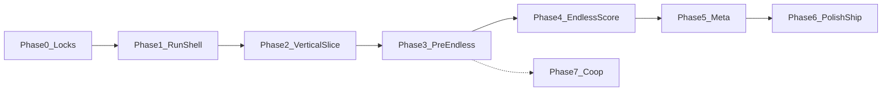

# Development phases

Phases are **production gates**, not calendar weeks. Durations are rough guidance for a solo or small team.

**Design lock:** [docs/GDD.md](../docs/GDD.md)  
**Principle:** Prove **fun and clarity** in a vertical slice before building breadth (content, meta, co-op).

---

## Phase 0 — Preproduction and locks

**Goal:** Decide anything that is expensive to reverse later.

**Content (suggested)**

- Paper **6-wave vertical slice** table (what spawns, what you intend the player to learn).
- **Enemy role** sketches (2–3) + **structure** sketches (1–2) + **commander ability** names and intent (no final numbers).
- **Boss / climax** one-paragraph beat (what changes moment-to-moment).
- Optional: **greybox map** screenshot or top-down sketch for the lane.

**Systems (suggested)**

- Locked **economy** doc: incomes, sinks, anti-turtle stance.
- Locked **scoring** doc: pillars, post-run breakdown fields, exploit stance.
- **Authoring conventions** (how waves, upgrades, and mutators will be represented: sheets vs ModuleScripts, etc.).
- **Telemetry questions** list (what you wish you had measured — no implementation yet).
- **Co-op appendix** (assumptions only): scaling, shared resources, death rules.

**Deliverables**

- GDD §7 (economy): income sources, sinks, anti-turtle stance (even if v0 numbers are wrong).
- GDD §8 (scoring): named score pillars + post-run breakdown fields + known exploit stance.
- One-page **vertical slice spec**: map sketch, one commander kit outline, 1–2 structures, 2–3 enemy roles, 6-wave script (paper).
- **Co-op appendix** in GDD or here: scaling placeholder (no implementation).

**Exit criteria**

- You can answer “what does Wave 1 teach?” and “why would someone queue run 2?” without hand-waving.
- Cut-list for v1 is explicit (what is not shipping).

**Out of scope**

- Production art pass, audio suite, monetization.

---

## Phase 1 — Project skeleton and run shell

**Goal:** A playable **empty run**: start → place holder → end screen, with correct **authority boundaries** (server vs client).

**Content (suggested)**

- **Greybox arena** (single lane blockout is enough).
- **Placeholder commander** (blocky R15 or capsule), minimal animations.
- **Placeholder UI** strings and layout for run / results.

**Systems (suggested)**

- **Run state machine** (lobby → run → results) and clean teardown.
- **Commander lifecycle** (spawn, damage, death) with server authority.
- **Minimal HUD** + **results** screen wiring.
- **Dev/debug** affordances: restart run, god mode, skip phase (server-gated).
- **Logging** hooks for run start/end and death events.

**Deliverables**

- Match / run state machine: `Lobby` → `Run` → `Results` (names flexible).
- **Commander entity** exists; **death** ends run and shows results.
- Minimal **HUD**: health, resource display (can be fake numbers at first), wave counter stub.
- Debug commands or admin panel: restart run, skip wave (dev only).

**Exit criteria**

- Cold start: new player can complete a “null run” without errors.
- Logging exists for run start/end and commander death (for future telemetry).

**Risks**

- Over-building UI frameworks before slice — keep UI disposable until Phase 3.

**Rough duration:** 3–10 days (depends on existing repo bootstrap).

---

## Phase 2 — Vertical slice (“one fun hour”)

**Goal:** **One lane**, **one wave loop**, **one enemy family**, **one spend sink** that proves prep → combat → payoff.

**Content (suggested)**

- **6 hand-authored waves** (data only is fine).
- **One structure** with a clear job (damage or control).
- **One summon / deployable** that supports summoner fantasy.
- **One enemy family** (visual reuse across waves is OK).
- Minimal **SFX** for spawn, hit, death, ability, UI confirm.

**Systems (suggested)**

- **Wave runner** (spawn schedule, wave start/end signals).
- **Prep phase** timer and **combat phase** transitions.
- **Placement** rules (grid, radius, lane pads — pick one simple model).
- **Resource** spend + income (even if tuned badly).
- **Lane movement / pathing** for enemies; **targeting** for defenses.
- **Commander ability** pipeline (input → validation → server execution → feedback).

**Deliverables**

- Lane + spawn point + goal point (core leak or commander damage — pick one v0 rule and document it).
- **Prep timer** (even if fixed duration) → **combat** → **brief reward** (placeholder: +Energy or pick-one upgrade).
- **One structure** that clearly changes outcomes (e.g. single-target turret or slow field).
- **One summon or deployable** tied to commander fantasy (even if one button).
- **6 waves** scripted by hand (composition table, not procedural).

**Exit criteria**

- Non-designer playtester understands **why they lost** without coaching.
- You would happily play the slice twice in one sitting.

**Out of scope**

- Boss, endless, mutators, meta, cosmetics, narrative.

**Rough duration:** 2–4 weeks.

---

## Phase 3 — Core loop completion (pre–endless)

**Goal:** Full **pre-climax** loop: varied waves, multiple sinks, upgrade cadence, tutorial beats.

**Content (suggested)**

- **Structure roster** (subset of v1; each needs a distinct job).
- **Enemy role set** with a clear **introduction order** (teach counters).
- **Upgrade / reward content** (cards, items, or shop SKUs — match the model you chose in Phase 0).
- **Climax encounter** (boss or multi-phase set piece) + one **tutorial beat** per new system.
- **Audio pass** for critical feedback (incoming wave, elite spawn, low commander HP).

**Systems (suggested)**

- **Reward / draft / shop** pipeline between waves (one primary model).
- **Wave authoring** at scale (templates, composition tags, validation).
- **AI variety hooks** (behaviors per role: tank line, artillery stop-and-shoot, etc.).
- **Combat feedback**: damage numbers optional, telegraphs for big hits.
- **Onboarding** system (constraints, prompts, or guided first waves).
- Early **settings**: camera sensitivity, keybinds if PC-first.

**Deliverables**

- **Structure roster** toward v1 target (see GDD; ship subset if needed).
- **Enemy role set** (swarm / tank / disruptor / artillery — subset ok) + introduction order.
- **Upgrade / reward** between waves (deck, shop, or draft — pick one model).
- **Scripted climax** encounter (v1 boss or set piece) that ends “Act A.”
- Onboarding: first-run prompts or constrained first waves.

**Exit criteria**

- Median session lands in **20–30 minute** band for target audience (measure, don’t guess).
- Losses cluster around **tactical** and **prep** errors, not confusion.

**Rough duration:** 3–6 weeks after slice.

---

## Phase 4 — Endless, mutators, scoring

**Goal:** Post-climax **endless** with **mutator escalation** and **credible score**.

**Content (suggested)**

- **Mutator deck** (start small: 6–10 strong mutators beats 30 weak ones).
- **Results** layout: score total + pillar breakdown + run stats (waves, time, mutators seen).
- Optional: **milestones** (badges for wave thresholds) — data-light.

**Systems (suggested)**

- **Endless wave driver** (budget curves, composition selection).
- **Mutator stack / rotation** logic + UI surfacing (“what is active now?”).
- **Score event bus** (sources emit events; scorer aggregates; audit trail for debugging).
- **Persistence** for personal bests (and optional global leaderboards later).
- **Run migration** state: handoff from “Act A” climax into endless without soft-locking.

**Deliverables**

- Endless wave driver (budget / composition rules + mutator application).
- **Mutator deck** (start with fewer, sharper mutators rather than many weak ones).
- Score pipeline: event sources → run total → **results breakdown** UI.
- Personal bests storage (DataStore or local profile — decision in implementation).

**Exit criteria**

- Score breakdown answers “why did I gain/lose?” for 90% of runs in internal playtests.
- Obvious idle / exploit loops have a **design or systems** response (mutator, scoring, or spawn rule).

**Rough duration:** 2–5 weeks.

---

## Phase 5 — Meta progression and retention

**Goal:** Reasons to return without breaking difficulty integrity.

**Content (suggested)**

- **Unlock tree** data (nodes, prerequisites, copy).
- **Pre-run loadouts** (what the player picks before match).
- Optional: **cosmetics** that do not affect combat (if you want Roblox-native retention).

**Systems (suggested)**

- **Profile / meta** storage and migration (schema versioning).
- **Unlock rules** server-side (never trust client flags).
- **Hub UI** flow: browse unlocks → edit loadout → queue run.
- **Balance knobs** per content row (cost curves, unlock tiers) separated from core combat code where practical.

**Deliverables**

- Meta currency or unlock tree (horizontal bias per GDD).
- Loadout or pre-run choices that **change playstyle**, not only +10% damage.
- Optional: daily / weekly mutator rotation (only if ops cost is acceptable).

**Exit criteria**

- Second-session pick rate meets your internal bar (define in GDD metrics section when ready).
- Power creep does not flatten early waves for experienced players (spot-check with veterans).

**Rough duration:** 2–4 weeks.

---

## Phase 6 — Polish, performance, ship prep

**Goal:** Roblox-ready **performance**, **UX clarity**, **telemetry**, release hygiene.

**Content (suggested)**

- **UI readability** pass (contrast, font sizes, mobile-safe touch targets if applicable).
- **Final placeholder replacement** for anything still blocking comprehension.
- **String table** / localization-ready copy for all player-facing text.
- Store / game page assets as needed (icons, thumbnails).

**Systems (suggested)**

- **Performance budget** enforcement (entity caps, pooling, LOD, pathfinding throttles).
- **Telemetry** pipeline + a minimal **dashboard or export** workflow.
- **Error reporting** (handled errors, rate limits, PII-safe payloads).
- **Release hygiene**: version tagging, changelog discipline, rollback plan for live tuning tables.

**Deliverables**

- Perf budget: max units, pathfinding limits, VFX LOD rules documented.
- Telemetry: run length, death wave, score components, quit points.
- Audio pass (minimal), UI readability pass, localization hooks if needed.
- Bug bash + balance pass focused on **Wave 1–3** and **first endless transition**.

**Exit criteria**

- No critical-class crashes in soak tests.
- **Content complete** definition met for your v1 label (whatever you locked in Phase 0).

**Rough duration:** 2–6 weeks.

---

## Phase 7 — Co-op (product phase 2)

**Goal:** Add **multiplayer run** without rewriting core loop.

**Content (suggested)**

- **Co-op UI**: party list, ready flow, shared timers, “whose ability is this?” clarity.
- Optional: **ping wheel** or emote wheel (communication without voice).
- Cosmetic **team readouts** (colors, icons) if confusion shows up in tests.

**Systems (suggested)**

- **Session model** (host / matchmaking / private servers — pick one product strategy).
- **Replication** review for run state, placements, and projectiles.
- **Enemy scaling** formula vs player count + tuning spreadsheet.
- **Disconnect / rejoin** policy (forfeit vs bot vs pause — decide explicitly).
- **Anti-grief** basics (who can sell structures, pause, vote kick).

**Deliverables**

- Network model for shared lane pressure, revive or shared-life rules (per GDD co-op appendix).
- Scaling: enemy budget vs player count.
- UI: shared objectives, ping wheel (optional), disconnect handling.

**Exit criteria**

- Two-player runs are stable; griefing surface is understood (vote kick? host-only pause?).

**Rough duration:** 4+ weeks (high variance).

---

## Dependency graph (simplified)

Co-op is intentionally **after** a shippable solo v1 unless you explicitly choose otherwise.

---

## What to do next (today)

1. Finish **Phase 0** economy + scoring one-pagers inside [docs/GDD.md](../docs/GDD.md).  
2. Write the **6-wave vertical slice table** (paper) before expanding `Chapter-01.md`.  
3. Only then start **Phase 1** engineering tickets derived from Phase 2 slice needs (avoid unrelated refactors).
