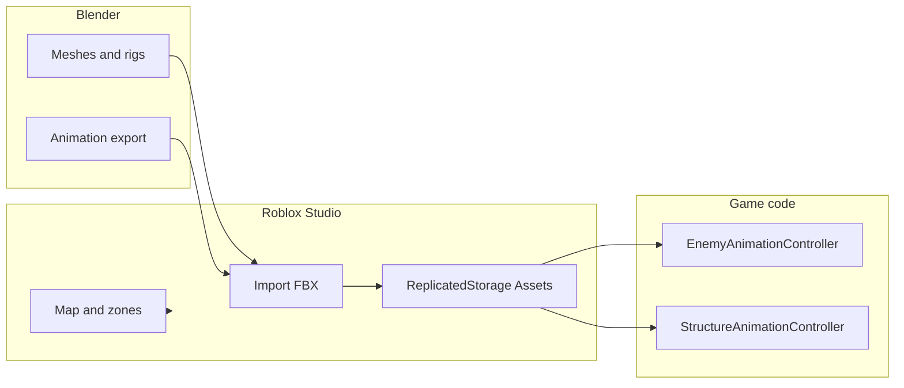

# Phase 2 — Studio vs Blender production

Production split for the **Phase 2 vertical slice**: what to author in **Roblox Studio** vs what to **model, rig, and animate in Blender** (or another DCC), then import. Aligns with [docs/GDD.md](../../docs/GDD.md) §5–7.2, §9–10.3, [GamePlan/Development-Phases.md](../../GamePlan/Development-Phases.md) (Phase 2), and [Phase2CompletionChecklist.md](Phase2CompletionChecklist.md).

When this doc conflicts with the GDD or `Development-Phases`, **GDD + Development-Phases win**.

---

## Code vs design alignment

- [EnemyConfig.lua](../../src/ReplicatedStorage/Contexts/Enemy/Config/EnemyConfig.lua) defines roles `swarm` and `tank` but `PHASE2_ALLOWED_ROLES` currently allows only `swarm`.
- GDD §10.3 allows a **Bruiser tease** in waves 1–6. If that ships, **asset paths and animation variant folders must use the same string** as the `EnemyRole` attribute (today that would be `tank`, unless engineering renames to `bruiser`).
- **Art rule:** `ReplicatedStorage/Assets/Entities/Enemies/{role}` and `ReplicatedStorage/Assets/Animations/{role}` folder names match the **canonical role key** in code, not the display name.

---

## Roblox Studio (authoring, blockout, integration)

| Area | What to do |
|------|------------|
| **Play space** | Single-lane map; zones per GDD §9: `lane`, `side_pocket`, `base_anchor`, `blocked`. Terrain/parts, spawn point, lane path, **`base_anchor` pad**, pocket pads, lighting/fog, camera feel. **Environment theme and zone visuals:** [Phase2EnvironmentDesign.md](Phase2EnvironmentDesign.md). |
| **Asset hierarchy** | Maintain `ReplicatedStorage/Assets/` folders the code expects: `Entities/Enemies/{role}`, `Entities/Players/...`, `Structures/{structureType}`, shared `Animations`. See [EntityRegistry.lua](../../src/ReplicatedStorage/Utilities/Assets/EntityRegistry.lua), [StructureRegistry.lua](../../src/ReplicatedStorage/Utilities/Assets/StructureRegistry.lua), [EnemyInstanceFactory.lua](../../src/ServerScriptService/Contexts/Enemy/Infrastructure/Services/EnemyInstanceFactory.lua). |
| **Animation binding** | Enemy instances get an `ObjectValue` named **AnimationsFolder** pointing at `ReplicatedStorage/Assets/Animations` (when that folder exists). |
| **Placeholders** | Fallback enemies are simple `Humanoid` + `HumanoidRootPart` models from code if no asset is registered. Swarm drones are currently procedural `Part` spheres ([SummonRuntimeService.lua](../../src/ServerScriptService/Contexts/Summon/Infrastructure/Services/SummonRuntimeService.lua)); Studio can replace with meshes when ready. |
| **VFX / audio** | Phase 2 checklist expects minimal SFX; tracers, impacts, and cheap **Particles/Beams** belong in Studio. |
| **UI / HUD** | 2D icons, frames, and prompts—Studio or external 2D tools—not Blender unless you deliberately use 3D viewport UI. |

---

## Blender (or DCC) — meshes, rigs, exported animations

Prioritize **silhouette, repetition, and “defend this” readability**.

| Asset | Notes | Target in `ReplicatedStorage/Assets` |
|-------|--------|--------------------------------------|
| **Command post (base)** | Hero prop at lane terminus; must read at **`base_anchor`**. Exact folder name is project convention (e.g. map folder or `Buildings`); wire it in Studio so the authoritative **base** instance is obvious in play. | Document chosen path next to the placed instance. |
| **Sentry Turret** | Only §7.2 structure required for Phase 2; plan for **tier** silhouette changes later. | `Structures/SentryTurret` (see [StructureConfig.lua](../../src/ReplicatedStorage/Contexts/Structure/Config/StructureConfig.lua)). |
| **Extractor** | If the slice uses **side_pocket** income, players must distinguish Extractor vs turret. Type string: [MiningConfig.EXTRACTOR_STRUCTURE_TYPE](../../src/ReplicatedStorage/Contexts/Mining/Config/MiningConfig.lua) (`Extractor`). | `Structures/Extractor` (or folder name matching placement/mining conventions). |
| **Swarm enemy** | One enemy **family** for the slice; many instances on screen. | `Entities/Enemies/swarm` (matches registry lookup by role). |
| **Bruiser / tank (optional)** | GDD Bruiser tease; larger read than swarm. | `Entities/Enemies/tank` or final role key. |
| **Swarm drone summon** | Replaces placeholder spheres. **Recommended for Phase 2 speed:** Studio-only **spin/tween** on a simple imported mesh **or** a non-skinned `MeshPart` parented under the spawned part; **optional later:** small `Model` + `Humanoid` if you add a full animation preset. | Meshes under `Assets` as agreed with whoever touches `SummonRuntimeService`. |
| **Commander** | Summoner/tactician fantasy; ability readability. | `Entities/Players/{class}` if using [EntityRegistry](../../src/ReplicatedStorage/Utilities/Assets/EntityRegistry.lua) for non-default rigs. |

**Defer / Studio-first:** greybox terrain, invisible colliders, debug markers, most UI, Scrap world pickups unless you already spawn collectible meshes.

---

## Animation inventory

### Enemies (`EnemyLocomotion` preset)

**References:** [AnimationPresets.lua](../../src/StarterPlayerScripts/Contexts/Animation/Infrastructure/AnimationPresets.lua) (`EnemyLocomotion`), [AnimationRigResolver.lua](../../src/StarterPlayerScripts/Contexts/Animation/Infrastructure/AnimationRigResolver.lua), [AnimationClipLoader.lua](../../src/StarterPlayerScripts/Contexts/Animation/Infrastructure/AnimationClipLoader.lua), [EnemyGameObjectSyncService.lua](../../src/ServerScriptService/Contexts/Enemy/Infrastructure/Persistence/EnemyGameObjectSyncService.lua), [AttackAction.lua](../../src/StarterPlayerScripts/Contexts/Enemy/Actions/AttackAction.lua).

| Requirement | Detail |
|-------------|--------|
| **Rig** | `Model` with `Humanoid` and `Animator` (resolver creates `Animator` if missing). |
| **Root folder** | `ReplicatedStorage/Assets/Animations`. |
| **Variant subfolders** | One folder per `EnemyRole` attribute value (e.g. `swarm`, `tank`), plus **`Default`** for fallback clips. |
| **Core loops (folder names lowercase)** | `idle`, `walk`, `run` — each folder contains an `Animation` instance. `Run` falls back to `Walk` if missing. |
| **Attack** | Folder name **`AttackStructure`** (exact casing). Non-looping action; key matches [AttackAction.lua](../../src/StarterPlayerScripts/Contexts/Enemy/Actions/AttackAction.lua) `AnimationKey`. |
| **Attack event** | Marker **`Strike`** — drives server `ActivateHitbox` (same pattern as structures). |
| **Replicated states** | Server sets attributes `AnimationState` to `Idle`, `Walk`, `Run`, or `AttackStructure`; `AnimationLooping` is `false` during `AttackStructure`. |

Author **one full set per role** you ship in Phase 2 (minimum: **swarm**; optional: **tank**).

### Structures — Sentry Turret (`Structure` preset)

**References:** [AnimationPresets.lua](../../src/StarterPlayerScripts/Contexts/Animation/Infrastructure/AnimationPresets.lua) (`Structure`), [StructureAttackAction.lua](../../src/StarterPlayerScripts/Contexts/Structure/Actions/StructureAttackAction.lua), [StructureGameObjectSyncService.lua](../../src/ServerScriptService/Contexts/Structure/Infrastructure/Services/StructureGameObjectSyncService.lua).

| Requirement | Detail |
|-------------|--------|
| **Core** | Folder **`idle`** (looping). |
| **Attack** | Folder **`attack`** (lowercase). Loader maps this to action **`Attack`**, driven by combat state **`StructureAttack`**. |
| **Attack event** | Marker **`Strike`** — primary hitbox timing; if missing, client falls back to activating hitbox after ~1/3 s ([StructureAttackAction.lua](../../src/StarterPlayerScripts/Contexts/Structure/Actions/StructureAttackAction.lua)). |

Structure models need the same **Animations** wiring pattern as other animated props in your slice (structure animation controller + shared or per-model `AnimationsFolder`).

### Commander / player

If the commander uses **R15** (or Roblox-standard rigs), lock the **rig type** in writing so animators export the correct skeleton. Full player preset uses many poses ([AnimationPresets.lua](../../src/StarterPlayerScripts/Contexts/Animation/Infrastructure/AnimationPresets.lua) `Player`); Phase 2 only *requires* whatever locomotion and ability feedback you already show in third-person. Custom rigs need explicit joint naming and import validation in Studio.

### Swarm drones

No `EnemyLocomotion` hookup today. Prefer **Studio VFX/motion** on a simple mesh for Phase 2; escalate to a rigged drone only if design demands it.

---

## Pipeline overview

---

## Cross-check vs Phase 2 exit checklist

| Checklist theme | Art / content implication |
|-----------------|---------------------------|
| Lane + base legibility | Command post model at `base_anchor`; readable damage/loss. |
| One structure | **Sentry Turret** model + `idle` / `attack` + `Strike`. |
| One summon / deployable | Drone read (mesh + motion); optional polish. |
| One enemy family | **Swarm** model + anim set; optional **tank** set if role enabled. |
| Commander + abilities | Commander silhouette; minimal feedback for abilities in checklist scope. |
| Minimal SFX | Not Blender; pair Studio audio with animations (e.g. `Strike` timing). |

---

## Export / import reminders (Blender to Roblox)

- Keep **scale** consistent with existing `EnemyConfig` role scales or authored `PrimaryPart` size; re-verify `HumanoidRootPart` and `PrimaryPart` after import.
- Animation names in Studio are carried by **`Animation` instances** in the folder slots above, not only by internal clip names in the DCC.
- For every attack clip that should sync damage, add **`Strike`** at the intended frame on both enemy **`AttackStructure`** and structure **`attack`** clips.
